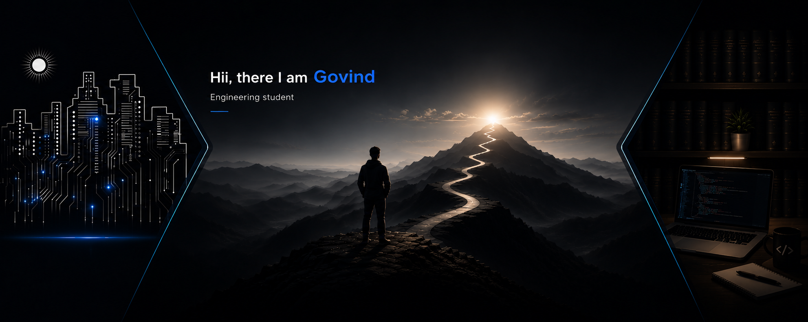

<p align="center">
  
</p>

<h1 align="center">Govind Singh Chouhan</h1>

<p align="center">
  <strong>Software Developer · Full-Stack &amp; Edge AI</strong>
</p>

<p align="center">
  I build practical software—from web applications to computer-vision systems at the edge.
</p>

<p align="center">
  <a href="mailto:govindschouhan27@gmail.com">Email</a>
  &nbsp;·&nbsp;
  <a href="https://github.com/GovindSChouhan">GitHub</a>
</p>

---

## About

I am an Electronics and Communication Engineering student at **JUET** and a Software Development Intern at **Central Electronics Limited (CEL)**. I enjoy building reliable full-stack applications and exploring Edge AI and computer vision systems. I am actively strengthening my problem-solving skills through data structures and algorithms.

## Technical toolkit

```text
Languages      Java · JavaScript · Python · C++
Frontend       HTML5 · CSS3 · Bootstrap · EJS
Backend        Node.js · Express.js · Flask
Database       MongoDB · Mongoose
AI / Vision    OpenCV · Raspberry Pi · Computer Vision
Tools          Git · GitHub · VS Code · Cloudinary · Netlify · Render
```

## Featured projects

### VisionAI Smart Stick

An assistive navigation system that helps visually impaired users move more safely through real-time computer vision, ultrasonic sensing, and voice guidance on a Raspberry Pi.

- Detects obstacles, stairs, potholes, people, vehicles, and nearby objects in real time.
- Combines a Raspberry Pi, Camera Module, and three ultrasonic sensors for continuous environmental awareness.
- Includes a Flask dashboard for local monitoring of live sensor readings and annotated camera output.
- Uses priority-based voice alerts to deliver the most important navigation warning first.
- Performs inference locally as an Edge AI application, without cloud dependency.

**Tech:** `Python` · `OpenCV` · `Flask` · `Raspberry Pi` · `Camera Module` · `Ultrasonic Sensors`<br />
**Repository:** [VisionAI Smart Stick](https://github.com/GovindSChouhan/VisionAI-Smart-Stick)

---

### StayNest

A full-stack accommodation platform that helps college students discover, list, and manage affordable stays through a modern web application.

- Follows MVC architecture with authentication, authorization, reviews, and image uploads.
- Uses MongoDB for persistent data and Cloudinary for image management.
- Delivers responsive, server-rendered pages with Bootstrap and EJS.
- Supports secure CRUD operations for listings with user access control.
- Built as a production-style project for practical backend development experience.

**Tech:** `JavaScript` · `Node.js` · `Express.js` · `MongoDB` · `Mongoose` · `EJS` · `Bootstrap` · `Cloudinary`<br />
**Live demo:** [StayNest](https://staynest-m9ju.onrender.com) · **Repository:** [Source code](https://github.com/GovindSChouhan/StayNest)

---

### Railway Axle Counter Simulation

A browser-based simulation of a railway axle-counter system, created during my Software Development Internship at Central Electronics Limited (CEL).

- Simulates railway track occupancy through axle counting between track sections.
- Applies Queue, Stack, Binary Search Tree, and Merge Sort in an industrial workflow.
- Provides an interactive dashboard for train movement and fault simulation.
- Makes railway-signalling concepts more approachable for learning and demonstration.
- Informed by study of an industrial railway monitoring system.

**Tech:** `JavaScript` · `HTML5` · `CSS3` · `Queue` · `Stack` · `BST` · `Merge Sort`<br />
**Live demo:** [Railway Axle Counter](https://cel-railway-axle-counter.netlify.app/frontend/index.html) · **Repository:** [Source code](https://github.com/GovindSChouhan/CEL-Railway-Axle-Counter-Simulation)

---

### DSA Journey

A structured repository documenting my preparation for software engineering interviews through data structures and algorithms.

- Organizes solutions topic-wise along a structured learning roadmap.
- Covers arrays, strings, linked lists, trees, graphs, dynamic programming, and more.
- Uses Java for interview-oriented implementations.
- Updated regularly to build consistency and strengthen core problem-solving skills.

**Tech:** `Java` · `Data Structures` · `Algorithms`<br />
**Repository:** [DSA Journey](https://github.com/GovindSChouhan/DSA-Journey)

---

### AudioSphere

A responsive music-streaming web interface inspired by Spotify, built to strengthen core frontend development skills.

- Built with semantic HTML5 and CSS3.
- Uses Flexbox to create responsive layouts across screen sizes.
- Focuses on reusable UI components and clean visual structure.
- Reinforced practical foundations in responsive web development.

 HEAD
**Tech:** `HTML5` · `CSS3` · `Flexbox` · `Responsive Design`<br />
**Live demo:** [AudioSphere](https://audiospher.netlify.app/) · **Repository:** [Source code](https://github.com/GovindSChouhan/AudioSphere)

`HTML` `CSS`

## Technical Skills

```text
Languages      Java • JavaScript • Python • C++

Frontend       HTML5 • CSS3 • Bootstrap • EJS

Backend        Node.js • Express.js • Flask

Database       MongoDB • Mongoose

AI / Vision    OpenCV • Raspberry Pi • Computer Vision

Tools          Git • GitHub • VS Code • Cloudinary • Netlify • Render
```


## Areas of interest

Full-Stack Development &middot; Edge AI &middot; Computer Vision &middot; Embedded Systems &middot; Assistive Technology &middot; Data Structures &amp; Algorithms

## Connect

<a href="https://www.linkedin.com/in/your-linkedin-username/">LinkedIn</a> &middot;
<a href="mailto:your.email@example.com">Email</a> &middot;
<a href="https://example.com/your-resume">Resume</a>
 13aaffbf481cea3adf84acfd8e7e4cf567a66ec5

---

<p align="center">
  Open to software development opportunities and collaborative projects.
</p>
